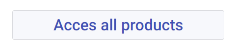
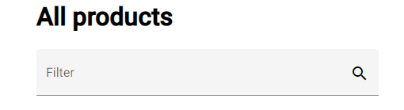
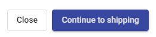

# DBL shop, an Angular practical work

This app is a simple shopping app.  
It has a landing page, a products page and a shopping cart dialog.  
Its a beautifull app but it has some bugs and require some work to be realy functionnal.

## How to install ?

Simply run `npm install` from the frontend folder.  
You can also install angular-cli globally with : `npm install -g @angular/cli`

## Usefull Commands

Here is some usefull commands to help you work with the app :

- `npm start` : serveur de debug local
- `npm run build` : build de l'application
- `npm run build:deploy` : build de l'application config deploy
- `npm run format` : indentation de l'application
- `npm run format:fix` : indentation des fichier staged
- `npm run format:check` : test de l'indentation
- `npm run lint` : Analyse de code statique
- `npm run test` : lancement des tests mode interactif
- `npm run test:headless` : lancement des tests
- `npm run test:mutation` : lancement des tests de mutation
- `npm run compodoc` : génération de la documentation

## Development server

Run `ng serve` for a dev server. Navigate to `http://localhost:4200/`. The app will automatically reload if you change any of the source files.

## What you have to do?

Now the fun part.

---

### Bugs correction

First off all you have to correct a bug on the home page.  
All our users seem unable to use the big button to access our product page.  

  

After that can you make the filter work on the products page please.  

  

---

### The feature

So our users can now add product to their cart but there is no shipping page.  
Can you please add one, it would be acceced after the user click on the `continue to shipping` button inside the shopping cart.  

  

 
This new component must have its own route and be inside the example module.

---

### Mocks VS Realworld

Your app si currently using mocks instead of calling the real API.  
If you have completed the backend part fo this tutorial you can now use real HTTP calls.  
You should probably check `product.service.ts` and `config.dev.json`.

---

### Dont forget the unit test

Please do not forget to correctly unit test all your developpements

## TL;DR

- Install deps : `npm install`
- Run the app : `npm start`
- Correct the big button on the home component
- Make functionnal the filter field
- Create a new component that handle all shipping info and a recap of the shopping cart
- Switch from mock to real API calls
- Dont forget to unit test your app.

  

